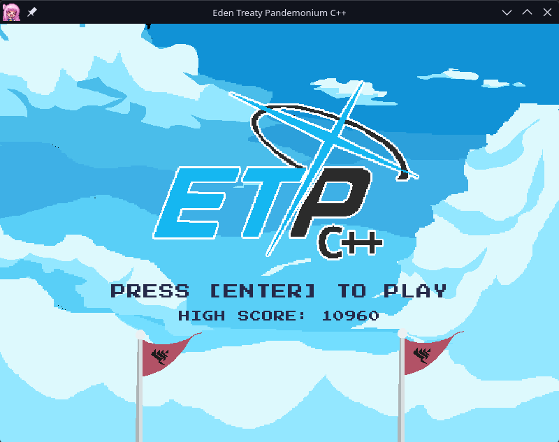

<p align="center">
  <h1>Eden Treaty Pandemonium</h1>
  <i>A simple Blue Archive-themed Touhou style game written in C++.</i>
</p>
<p align="center">
  <a href="License">
    
  </a>
  <a href="https://github.com/arch2kx/etpraylib/actions/workflows/build.yml">
    
  </a>
</p>
<p align="center">
  
</p>

---

## How to Build

Builds via CMake, Raylib is downloaded automatically, no manual install needed. Every platform produces an executable named **ETP**: `ETP.app` on macOS, `ETP.exe` on Windows, and `ETP` on Linux.

### macOS / Linux

```bash
./build.sh clean run   # first build, or after any CMakeLists.txt change
./build.sh              # everyday incremental build
./build.sh run           # build and launch
```

(`chmod +x build.sh` once, if needed.)

On Linux, raylib's own build needs a few X11/OpenGL dev packages installed first:

```bash
# Debian / Ubuntu
sudo apt install libx11-dev libxrandr-dev libxinerama-dev libxcursor-dev libxi-dev libgl1-mesa-dev

# Fedora
sudo dnf install libX11-devel libXrandr-devel libXinerama-devel libXcursor-devel libXi-devel mesa-libGL-devel

# Arch
sudo pacman -S libx11 libxrandr libxinerama libxcursor libxi mesa
```

That's all you need, by default the game runs fine under Wayland too, via XWayland. If you'd rather build with native Wayland support, install these on top of the X11 packages above, then pass the `wayland` flag to the build script:

```bash
# Debian / Ubuntu
sudo apt install libwayland-dev libxkbcommon-dev wayland-protocols

# Fedora
sudo dnf install wayland-devel libxkbcommon-devel wayland-protocols-devel

# Arch
sudo pacman -S wayland libxkbcommon wayland-protocols
```

With Wayland:

```bash
./build.sh clean wayland run
```

### Windows

```bat
build.bat clean run
build.bat
build.bat run
```

Runs from `cmd` or PowerShell directly, WSL / Git Bash not required.

### Manual (any platform)

```bash
cmake -B build
cmake --build build
```

## App Icon

`assets/mikaIcon.png` is used as the game's icon everywhere — in the running window/taskbar (via `SetWindowIcon`), and as the OS-level app icon:

- **macOS** — bundled as `ETP.app` with a generated `.icns`
- **Windows** — embedded into `ETP.exe` via a generated `.ico` (needs ImageMagick's `magick`/`convert` on `PATH`; drop your own `assets/mikaIcon.ico` instead if you'd rather supply one)
- **Linux** — no icon is installed automatically. Run `./install-desktop-icon.sh` for an app-menu entry, or `./install-desktop-icon.sh desktop` to also place an icon on your Desktop folder

## Notes
I made this program primarily to learn how game programming works with different languages. I had an original pygame version but this one is much better. Also, I updated this game to be cross-platform and less confusing, hooray!

## Attribution
Most assets are my own besides the soundtrack.

Gameplay BGM (Unwelcome School 8-Bit):
https://www.youtube.com/watch?v=IJLnI8VbRSA

Titlescreen BGM (Hifumi Daisuki 8-Bit):
https://www.youtube.com/watch?v=jCWrW7UzV5E

Defeat SE (MikuMikuCamera):
https://www.youtube.com/watch?v=8yOCTjR5QEE

Victory BGM (Re-Aoharu 8-Bit)
https://youtube.com/watch?v=99_HJOQ9vSk
